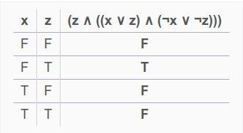
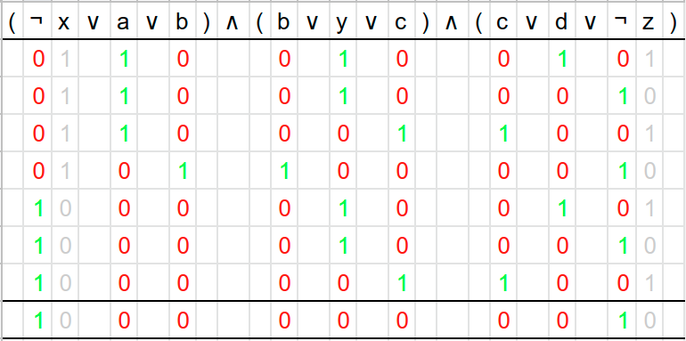
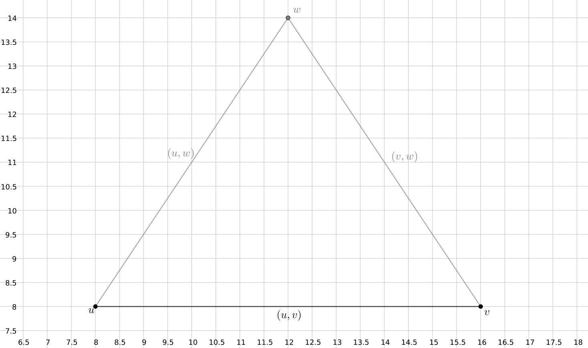

# H4.1
## (a)
The problem is in $𝐍𝐏$ because the problem is a special case on SAT which is in $𝐍𝐏$. Next, we will show that the problem is $𝐍𝐏$-complete by reducing SAT to this problem in polynomial time. For this reduction, we use the idea by @79218.

---

Let $ϕ$ be a SAT formula in CNF form. Then, new formula $ϕ'$ in CNF that is logically equivalent to $ϕ$ is constructed as follows.

Add all clauses $c$ in $ϕ$ that have $1$ or $2$ literals to $ϕ'$ unmodified.

For all clauses $c$ in $ϕ$ with more than $3$ literals

1) Create new clause $c'$ by substituting each negative literal $¬x$ in clause $c$ by new variable $z.$
2) Add clauses $c'$, $(x∨z)$ and $(¬x∨¬z)$ to the formula $ϕ'$.

---

Proof: Literal $z$ is forced to act as literal $¬x$ because
$$
z ∧ (x∨z) ∧ (¬x∨¬z)
$$
is true only if $z$ and $¬x$ are true, which is evident from its truth table.

## (b)
1-IN-3SAT is in $𝐍𝐏$ since verifying the correct solution is same as for normal SAT. We show $𝐍𝐏$-completeness by reducing 3SAT to 1-IN-3SAT.

---

We can reduce 3SAT to 1-IN-3-SAT by replacing each clause $c=(x∨y∨z)$ in 3SAT with the clause
$$
c'=(¬x∨a∨b) ∧ (b∨y∨c) ∧ (c∨d∨¬z).
$$

We can prove that $c'$ is 1-IN-3 satisfiable if and only if $c$ is satisfiable by using a truth table.

As can be seen, each of the first 7 rows are 1-in-3 satisfiable, but the last row representing assignment $x=0,y=0,z=0$ is not 1-in-3 satisfiable.

# H4.2
The solution was inspired by @Mount2017.

i) We show that dominating set (**DS**) is in **NP**.
ii) We reduce vertex cover (**VS**) to dominating set in logspace.

## (i)
Given a graph $G=(V,E)$, set $U⊆V$ is a dominating set if $U∪W=V$ where $W$ is the set of vertices adjacent to vertices in $U$, defined as
$$
W = \{w∣(u,w)∈E, u∈U\}.
$$
The verification can be done in polynomial time $O(|U||E|)=O(|V||E|)$, since $|U|≤|V|.$

## (ii)
We reduce deciding the vertex cover for undirected graph $G=(V,E)$ and integer $k$ to deciding dominating set for undirected graph $G'=(V∪V',E∪E')$ and integer $k+n$ where $n$ is the number of isolated nodes. We include $n$ in the size since the dominating set must include all isolated nodes by definition, but the vertex cover does not include them.

The graph $G'$ contains the original graph $G$ and auxialiary vertices $V'$ and auxialiary edges $E'.$

---

We can force the inclusion of atleast one of the vertices $(u,v)∈E$ in the dominating set such that it satisfies the condition for vertex cover as follows.

For each edge $(u,v)∈E,$ we add vertex $w$ to $V'$ and edges $(u,w)$ and $(v,w)$ to $E'.$ The dominating set must now include atleast one of the vertices in $u,v$ or $w$. If $w$ is included, we can replace it with $u$ or $v$ because the vertices $u,v$ and $w$ are adjacent, thus, the set still remains a dominating set.

---

Now, we find a dominating set $U'⊆V∪V'$ of size $k+n$ in graph $G'.$ Then, we create a new dominating set $U⊆V$ such that for each vertex $u∈U'$

1) If $u∈V$ and $u$ is not isolated, add $u$ to $U$.
2) If $u∈V'$ add one of its adjacent vertices to $U$.

The dominating set $U$ is a vertex cover of size $k$ of graph $G.$

---

The reduction is computable in constant space, and is therefore logspace computable.

# H4.3
## (i)
A Turing machine $M$ (with input and output) on input $k;x$, where $k≥0$, computes the mapping $x↦1^{k|x|}$ in linear time and constant space as follows.

1) Copy $k$ to work tape 1.
2) Copy $k$ from work tape 1 to work tape 2, which will act as a counter. Input tape cursor should be now in the first symbol of $x.$
3) Write $1$ for $k$ times on the output tape by reducing the counter each time $1$ is written until it reaches zero.
4) Move the input tape cursor to the next symbol of $x.$
5) Copy $k$ from work tape 1 to work tape 2.
6) Repeat from step (3) or halt if input tape cursor is on $⊔.$

## (ii)
We have padded universal set
$$
U = \{M;x;1^{|M||x|} ∣ \text{Turing machine } M \text{ accepts input } x \text{ in space } |x|\}
$$

<!-- $U$ is linear-complete if -->

<!-- $U∈\mathbf{SPACE}(n)$ -->

## (iii)

## (iiii)

# References
